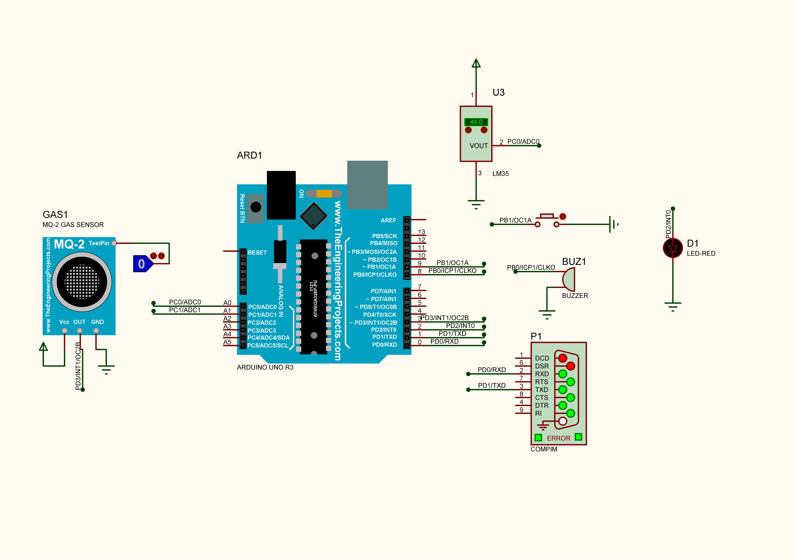
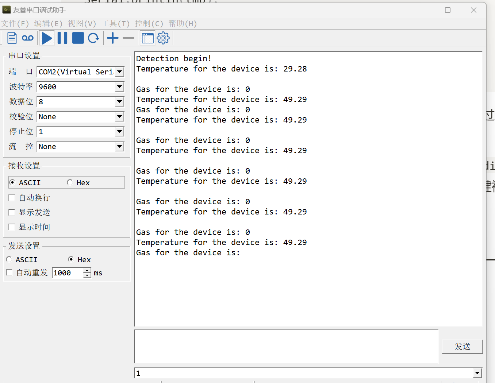
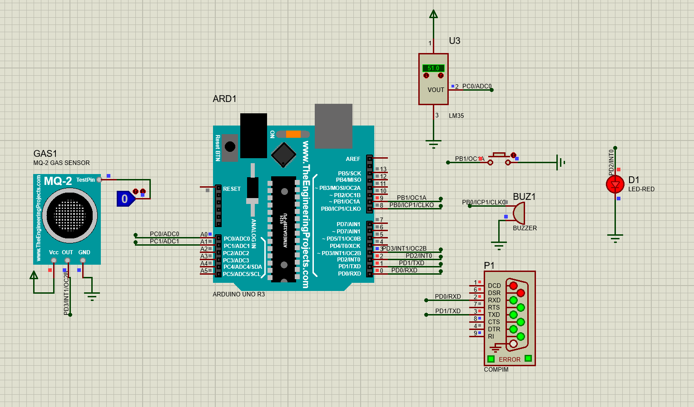
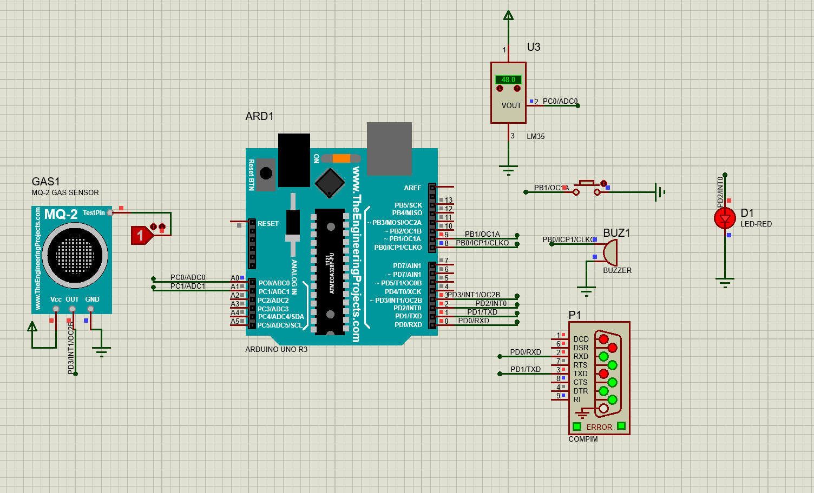
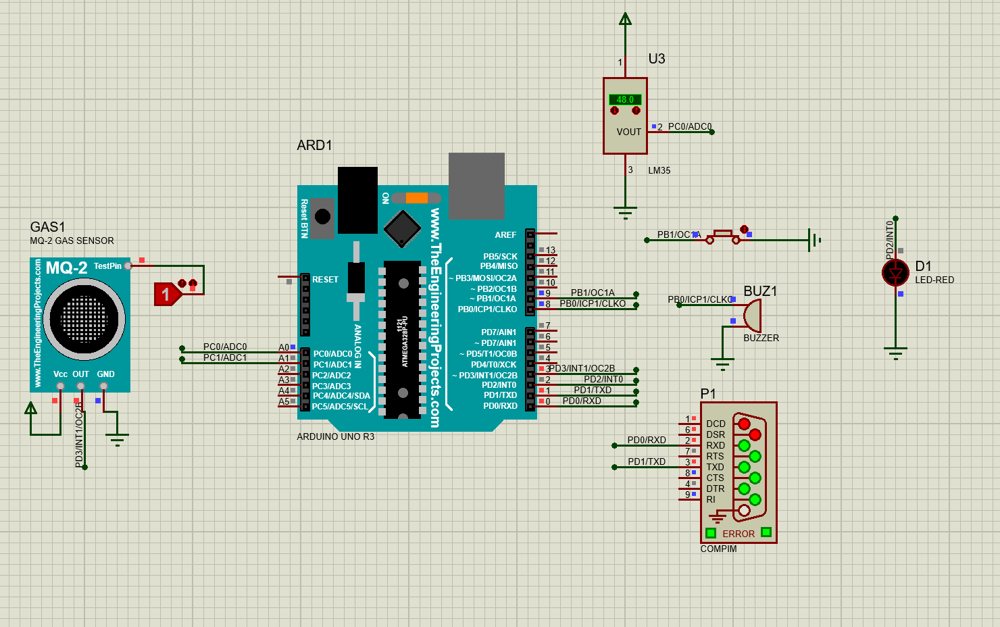

# Arduino-模拟火灾发生的自动报警控制器

## 原理图设计



**本原理图设计采用MQ-2烟雾传感器和LM35温度传感器用于火灾发生时的检测，通过串口输出当前的温度和气体状态，气体状态0表示无有害气体，气体状态1表示有有害气体。**


**当温度高于50℃或检测到有害气体时，蜂鸣器报警声响，LED报警灯亮。**


**按下按键，解除报警声和报警灯。**


**MQ-2烟雾传感器仿真元件库来自**`https://www.theengineeringprojects.com/2016/05/gas-sensor-library-proteus.html`

---

## Arduino源代码如下

```c
volatile float tmp;
int gas;
int key;

void setup()
{
  Serial.begin(9600);
  Serial.println("Detection begin!");
  tmp = 0;
  gas = 0;
  pinMode(8, OUTPUT);
  pinMode(3, INPUT);
  pinMode(9, INPUT);
}

void loop()
{ 
  tmp = analogRead(A0)*0.488;
  gas = digitalRead(3);
  key = digitalRead(9);
  if (tmp >= 50 || gas == 1) {  
    digitalWrite(9,HIGH);
    if(key==1){
      digitalWrite(2,HIGH);
      tone(8,500);
      delay(500);
    }else if(key==0){
      digitalWrite(2,LOW);
      noTone(8);  
    }
  } 
  else if (tmp < 50 && gas == 0) {
    digitalWrite(2,LOW);
    noTone(8);
  }
  
  Serial.print("Temperature for the device is: ");
  Serial.println(tmp); 
  Serial.print("Gas for the device is: ");
  Serial.println(gas);
  delay(500); 
}
```

- `arduino Uno R3` 的`A0`引脚接收`LM35`温度传感器发出的模拟信号，通过`analogRead(A0)*0.488`将输入的模拟信号转换为温度。

- 按键一端接地一端接`arduino`的`9`引脚，控制解除报警灯和报警声通过`digitalWrite(9,HIGH)` 向`9`引脚输入高电平。`key = digitalRead(9)`用于判断`9`引脚的电位情况，当按键被按下时`9`引脚接地，检测到`9`引脚为低电平，关闭蜂鸣器和LED报警灯。
- 通过串口打印输出传感器读取到的温度和气体状态。

---

## 实现效果

**串口打印**



**温度高于50℃，报警灯亮，蜂鸣器报警声响**



**检测到有害气体（气体状态为1），报警灯亮，蜂鸣器报警声响**



**按下按键报警灯和报警声解除**

